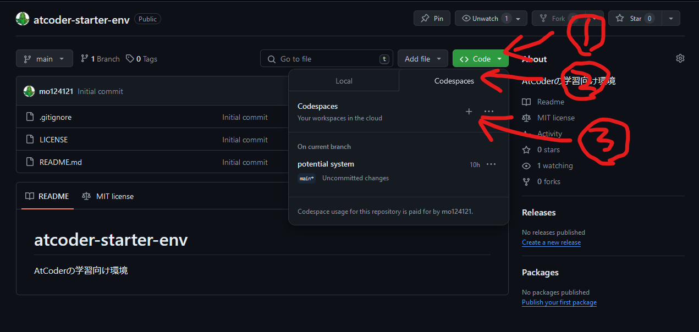

# atcoder-starter-env
AtCoderの学習向け環境

## 環境について

GitHub Codespacesを利用して起動することを想定しています。  
各自が利用している端末に依存することなくコーディングを始めることができます。

## 利用方法

GitHubにログインした状態で、下記画像で示した部分をクリックしてください。  

## 注意点

### 利用時間に上限がある

デフォルトで利用できるのは60時間/月の制限があります。  
詳しくはドキュメントを参照してください。

https://docs.github.com/ja/billing/managing-billing-for-github-codespaces/about-billing-for-github-codespaces#monthly-included-storage-and-core-hours-for-personal-accounts

### 放置すると環境が消える

デフォルトで1か月アクセスをしないと立ち上がったCodespaceは削除されます。  
ご自身のアカウントにフォークし、修正内容をコミットするなど、削除されても困らないように設定しましょう。